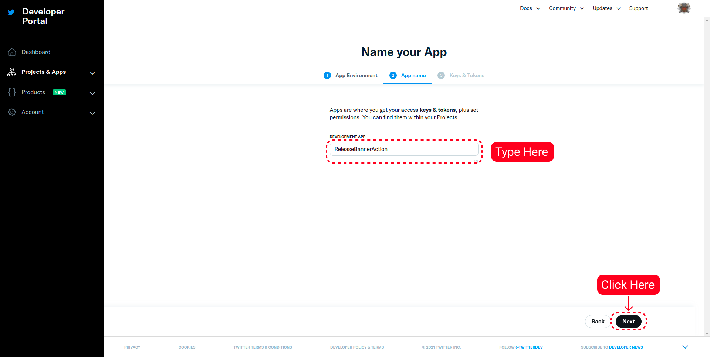
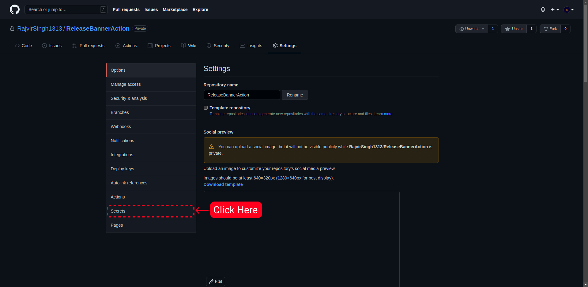

<div align="center">


</div>
<div align="center">


</div>

## Topics

- [What is ReleaseBannerAction ?](https://github.com/RajvirSingh1313/ReleaseBannerAction#what-is-releasebanneraction-)
- [How to use](https://github.com/RajvirSingh1313/ReleaseBannerAction#How-to-use)
  - [Getting Essentials](https://github.com/RajvirSingh1313/ReleaseBannerAction#Getting-Essentials)
    - [How to get keys from Twitter](https://github.com/RajvirSingh1313/ReleaseBannerAction#How-to-get-keys-from-Twitter)
    - [How to get webhooks from Discord](https://github.com/RajvirSingh1313/ReleaseBannerAction#How-to-get-webhooks-from-Discord)
  - [Quick Start](https://github.com/RajvirSingh1313/ReleaseBannerAction#Quick-Start)
  - [Inputs](https://github.com/RajvirSingh1313/ReleaseBannerAction#Inputs)
  - [Customizations](https://github.com/RajvirSingh1313/ReleaseBannerAction#Customizations)
    - [Themes](https://github.com/RajvirSingh1313/ReleaseBannerAction#Themes)
    - [How Create & Use Custom Banner](https://github.com/RajvirSingh1313/ReleaseBannerAction#how-create--use-custom-banner)
- [Story](https://github.com/RajvirSingh1313/ReleaseBannerAction#Story)
- [RoadMap](https://github.com/RajvirSingh1313/ReleaseBannerAction#RoadMap)
- [License](https://github.com/RajvirSingh1313/ReleaseBannerAction#License)
<hr/>

<h1><b>What is ReleaseBannerAction <i>?</i></b></h1>

ReleaseBannerAction is a simple GitHub Action that creates a dynamic image by fetching the information from the repository and using it in the image and then posting the banner to Twitter or discord, or both. There are various themes for the image and various other customizations that users can customize to fit their repository.

<h1>How to use</h1>

Using ReleaseBannerAction is super easy. There are several things you can customize. First of all, you need the credentials for Twitter or Discord for posting messages.

<h2>Getting Essentials</h2>

You can choose between Twitter and Discord or both for uploading the
banner. Here are the guides for getting all the required credentials for Twitter and Discord:-

<details>
  <summary><h1>How to get keys from Twitter</h1></summary>
    1. First you need to be signed, after that you will have to sign up for the developer account.
    <br/>
    2. Then go to your dashboard, and click on <code>Add App</code>, as shown in the image. 
    3. It will ask you what app environment it is, I will suggest you to choose Development. 
    4. Then just type the name of your application you like, As shown in the image. 
    5. It will show you the <code>Consumer Keys</code>, so save them somewhere as you will not be able to access them again without regenerating them. After that go to <code>App Settings</code>. 
    6. Go to <code>Keys and Tokens</code> Tab. 
    7. Now Generate the <code>Access Token And Secret</code> Keys, save them somewhere as you will not be able to access them again without regenerating them. 
    8. Then we need to get the <code>Elevated</code> Twitter API Access. You can go to https://developer.twitter.com/en/portal/products/elevated and apply for it.
    9. Now we have gathered all the keys and got <code>Elevated API Access</code> for our project. Now we just have to feed in to ReleaseBannerAction. So to do it, We have to go to the repository's settings. And then click on <code>Secrets</code>. 
    10. Click on <code>New repository secret</code>, and now you have to type the name of the secret very attentively. Type <code>TWITTER_ACCESS_TOKEN</code> for Twitter Access Token Key, <code>TWITTER_ACCESS_TOKEN_SECRET</code> for Twitter Access Token Secret, <code>TWITTER_CONSUMER_API_KEY</code> for Twitter Consumer API Key, and <code>TWITTER_CONSUMER_API_SECRET</code> for Twitter Consumer API Secret.
</details>

<details>
  <summary><h1>How to get webhooks from Discord</h1></summary>
  1. First you need to be signed into your Discord account.
  2. Click on the server settings. 
  3. Then click on the integration section, as shown in image below. 
  3. Click on <code>Create Webhook</code>, as shown in image below. 
  4. Discord will automatically create webhook with random name, you can customize the name and can change the channel on which the message would go. Copy the webhook url, and keep it in your clipboard.  
  5. Now we have the webhook, we just need to give it to ReleaseBannerAction. So to do that we have to go to repository's settings, and click on the <code>Secrets</code> section. 
  6. Click on <code>New repository secret</code> to create a new secret. Set the name of the secret to <code>DISCORD_WEBHOOK_URL</code>, and the webhook url as value. As shown in the image below. 
</details>

<h2>Quick Start</h2>

Create a YAML file, inside the `.github/workflows` folder. Copy and paste below YAML text into the file.

```yaml
on:
  watch:
    types: [started]
  release:
    types: [released]

jobs:
  Running:
    runs-on: ubuntu-latest
    name: ReleaseBannerAction
    steps:
      - name: Checkout
        uses: actions/checkout@v2
      - name: Action
        uses: ./
        with:
          action-name: ${{github.event.action}}
          release-version: ${{ github.event.release.tag_name }}
          repo-content-object: ${{ toJson(github) }}
          platform: Both

          banner-theme: Dark

          discord-webhook-url: ${{ secrets.DISCORD_WEBHOOK_URL }}
          twitter-consumer-key: ${{ secrets.TWITTER_CONSUMER_API_KEY }}
          twitter-consumer-secret: ${{ secrets.TWITTER_CONSUMER_API_SECRET }}
          twitter-access-token: ${{ secrets.TWITTER_ACCESS_TOKEN }}
          twitter-access-token-secret: ${{ secrets.TWITTER_ACCESS_TOKEN_SECRET }}
```

<h2>Inputs</h2>

| Input Name | Description | Default     | Is Required |
| ---------- | ----------- | ----------- | ----------- |
| `action-name` | It is for seeing whether action need to perform action on new release or repo surpassing certain threshold. | `undefined` | `True` |
| `repo-content-object` | Object for gathering information from github api about the project for showing in the banner. | `undefined` | `True` |
| `release-version` | For showing the latest release version in the banner. | `undefined` | `True` |
| `platform` | For knowing on which platform the message should be sent. Type twitter or discord as input, if want both input Both. Default is Both. | `Both` | `True` |
| `banner-theme` | Theme for the banner, There are three types of themes => Dark, Orange, Blue, Wonder, LightYear. Default is Dark. | `Dark` | `False` |
| `custom-banner` | If you have custom banner, then enter the relative path of the banner in the repository, please learn more about how to create custom banner here :- https://github.com/RajvirSingh1313/ReleaseBannerAction#how-create--use-custom-banner | `undefined` | `False` |
| `primary-color` | If have primary color for your custom banner then you can customize the primary color of the texts in the image. | `undefined` | `False` |
| `secondary-color` | If have secondary color for your custom banner then you can customize the secondary color of the texts in the image. | `undefined` | `False` |
| `custom-message` | If you are not happy with the default message that is sent with the banner, then you can input the message you like here. | `undefined` | `False` |
| `discord-webhook-url` |  Discord webhook url for making a message. | `undefined` | `False` |
| `twitter-consumer-key` |  Consumer API key, available in the "Keys and tokens" section of your application in the Twitter Developer site. | `undefined` | `False` |
| `twitter-consumer-secret` | Consumer API secret key, available in the "Keys and tokens" section of your application in the Twitter Developer site. | `undefined` | `False` |
| `twitter-access-token` | Application access token, available in the "Keys and tokens" section of your application in the Twitter Developer site. | `undefined` | `False` |
| `twitter-access-token-secret` | Application access token secret, available in the "Keys and tokens" section of your application in the Twitter Developer site. | `undefined` | `False` |

<h1>Customizations</h1>

There are following things you can customize:
 - Themes, There are various themes you can choose. You can set the theme by adjusting the `banner-theme` property.
 - Custom Banner, you can create your own banner. You can set the custom banner by setting the value of `custom-banner` to relative path of the banner in the repository.
 - Primary Color & Secondary Color to support the custom banner or to enhance the theme. To set primary color and secondary color, set the `primaryColor` property to primary color of your like and same for the secondary color with the `secondaryColor` property.
 - Custom message, you can customize the message that is sent with the banner. To customize the message, set the `custom-message` value to the message you like.

<h2>Themes</h2>

There are total of 5 themes, That I have created. I will add more themes in future. You can set the theme of the banner by settings the `banner-theme` property. Default is `Dark`.

<h3><b>Dark</b></h3>


<h3><b>Blue</b></h3>


<h3><b>Orange</b></h3>


<h3><b>LightYear</b></h3>


<h3><b>Wonder</b></h3>


<h2>How Create & Use Custom Banner</h2>


Upper Image a simple template with all the dimensions that you will need to create a banner to align perfectly with the ReleaseBannerAction.

# Story

I created this project for the Github Actions 2021 Hackathon. I am pretty exhausted while writing this long readme. I am sure that it has a lot of mistakes in it, But I am just gonna ignore them. This idea came like the merged idea, as first I thought about creating an action that will just notify others, and the other one was just my curiosity about a project which was updating the Twitter profile banner with the latest tweet reactions of the user's tweet. Anyways the funny part of what happened to me is that, when I first read about this hackathon, I thought that it is just about a one-day competition as I mistakenly took 8 December as 8 November. I don't know why how I read it. But even then without confirming it, I just made a quick submission with the first idea, submitting when I read the article again, I was like wait. It is 8 December? Oh damn, then I quickly deleted it and Just chilled for like a week for some ideas to flow in my mind, but the first idea kinda just stuck in my mind. And another funny thing that happened to me while creating this project was that, Whenever I created a new developer application in the Twitter developer portal, every app got suspended after just 12 hours, And every time it happened, I just deleted the application and just created a new one. Twitter just said It violated some terms and conditions, but they never told me which ones are violated. So out of frustration, I thought what if it happened to the user who will use ReleaseBannerAction, would they also go through the same suffering. So that's when I thought about adding Discord support.

# Roadmap

- A function that will show the reactions on the published release on github in the banner
- Showing the tags of the repo in the banner
- Custom Fonts

# License

[MIT](https://choosealicense.com/licenses/mit/)
